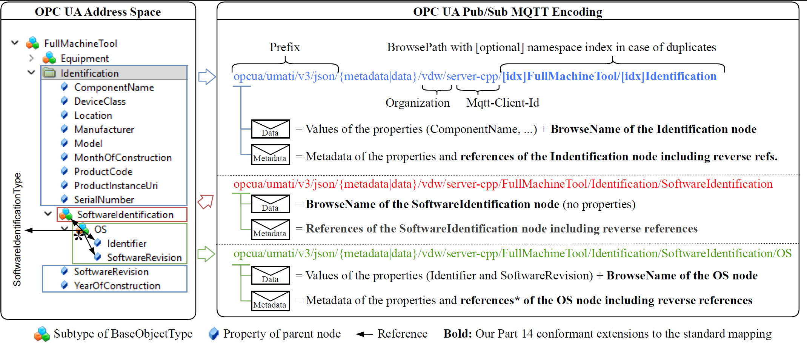

# PublishSubcribe (MQTT Transport and UA JSON encoding)

This page describe how to connect to the umati.app Dashboard by using PubSub instead of the server/client connection described in other parts of the Specification.

> PubSub allows the distribution of data and events from an OPC UA information source to interested observers inside a device network as well as in IT and analytics cloud systems.

- Detailed Specification of PubSub can be found at: [OPC 10000-14](https://reference.opcfoundation.org/Core/docs/Part14/) Part 14: PubSub
- The JSON mapping is describe in [Part14/7.2.3](https://reference.opcfoundation.org/Core/docs/Part14/7.2.3/)

## Example Datasets

- MachineTool Examples:
  - [ShowcaseMachineTool Data and Metadata](PubSub/Example-Dataset/Readme.md)

## Python Sample Publisher

A complete example of an OPC UA PubSub JSON publisher written in Python is available in the `PubSub/Python-Publisher` directory. It demonstrates how to publish OPC UA Part 14 JSON messages (`ua-metadata` and `ua-data`) directly to an MQTT broker following the umati conventions, without requiring a full OPC UA server.

Please refer to its [Readme](PubSub/Python-Publisher/Readme.md) for details on:

- **Message Structure** (detailed explanation of `ua-metadata` and `ua-data` fields)
- **MQTT Topic Layout** (the `opcua/umati/v3/json/...` topic convention)
- **Configuration** (how to configure an OPC UA Publisher to publish directly to the MQTT broker)

## Details on the Encoding Strategy

The idea of the showcase is to fully encode the address space into PubSub JSON messages and distribute them over mqtt. The mapping is constructed in such a way, that address space reconstruction is possible.

### 1. Overview

The encoding maps selected parts of an OPC UA AddressSpace to OPC UA PubSub messages transported via MQTT. The information is distributed between:

* **MQTT topics**, which represent the hierarchical BrowsePath,
* **DataSetMetaData**, which describes the DataSet and its fields and contains the encoded References,
* **DataSetMessages**, which contain the actual values and the `virtualId`.

The following example represents the `Identification` node of a `ShowcaseMachineTool`.

---

### 2. MQTT Topic

The MQTT topic reflects the hierarchical position of the node:

```text
opcua/umati/v3/json/data/vdw/server-cpp-dev/ShowcaseMachineTool/Identification
```

The relevant OPC UA path is therefore:

```text
ShowcaseMachineTool
└── Identification
```

The topic identifies the DataSet to which the transmitted values belong. The semantic information itself is provided by the accompanying metadata message.

---

### 3. DataSetMessage

The DataSetMessage contains the **current values** of the fields of the `Identification` node.
The actual message is structured as follows:

> Note: there are multiple encodings supported. We HIGHLY RECOMMEND the `verbose` one. The `non-verbose` encoding is DEPRECATED.

Verbose:
```json
{
  "MessageId": "bc919fec-a527-4278-be93-816d7070ced0",
  "MessageType": "ua-data",
  "PublisherId": "1",
  "Messages": [
    {
      "Payload": {
        "SerialNumber": {
          "UaType": 12,
          "Value": "2021-15360620311222485159"
        },
        "ProductInstanceUri": {
          "UaType": 12,
          "Value": "https://showcase.umati.org/Specs/Machinetools.html"
        },
        "Manufacturer": {
          "UaType": 21,
          "Value": {
            "Text": "umati Showcase"
          }
        },
        "YearOfConstruction": {
          "UaType": 5,
          "Value": 2021
        },
        "ProductCode": {
          "UaType": 12,
          "Value": "2653837gg1548"
        },
        "SoftwareRevision": {
          "UaType": 12,
          "Value": "v1.02.1"
        },
        "DeviceClass": {
          "UaType": 12,
          "Value": "Machining centre (other)"
        },
        "Location": {
          "UaType": 12,
          "Value": "EMO 6 A18/VIRTUAL 1 1/N 49.871215 E 8.654204"
        },
        "Model": {
          "UaType": 21,
          "Value": {
            "Text": "ShowcaseMachineTool"
          }
        },
        "virtualId": {
          "UaType": 12,
          "Value": "17:ShowcaseMachineTool.2:Identification"
        }
      }
    }
  ]
}
```
Non-verbose (DEPRECATED):
```json
{
  "MessageId": "c0f3f803-835c-4f92-bd7c-40a268facb64",
  "MessageType": "ua-data",
  "PublisherId": "1",
  "Messages": [
    {
      "Payload": {
        "SerialNumber": "2021-15360620311222485159",
        "ProductInstanceUri": "https://showcase.umati.org/Specs/Machinetools.html",
        "Manufacturer": "umati Showcase",
        "YearOfConstruction": 2021,
        "ProductCode": "2653837gg1548",
        "SoftwareRevision": "v1.02.1",
        "DeviceClass": "Machining centre (other)",
        "Location": "CCMT 5 A219/GRIND 9 B20/VIRTUAL 1 1/N 49.871215 E 8.654204",
        "Model": "ShowcaseMachineTool",
        "virtualId": "17:ShowcaseMachineTool.2:Identification"
      }
    }
  ]
}
```


The values correspond to the fields defined in the metadata, such as `SerialNumber`, `Manufacturer`, `YearOfConstruction`, and `SoftwareRevision`.

#### `virtualId`

The additional `virtualId` field contains:

```text
17:ShowcaseMachineTool.2:Identification
```

It encodes the **BrowsePath** of the node:

```text
Namespace 17 → ShowcaseMachineTool → Namespace 2 → Identification
```

Thus, the `virtualId` allows the Subscriber to identify the node's position independently of the MQTT topic.

---

### 4. DataSetMetaData

The corresponding metadata message uses:

```text
MessageType = ua-metadata
PublisherId = 1
DataSetWriterId = 213
```

and identifies the DataSet using:

```text
Name = ns=17;i=59008
```

This is the `NodeId` of the encoded `Identification` node.
The metadata additionally contains the **NamespaceArray**. This allows namespace indices used by NodeIds, BrowseNames, and the `virtualId` to be resolved to their namespace URIs.

---

### 5. Field Metadata

Every value transmitted in the DataSetMessage has a corresponding entry in `MetaData.Fields`.

For example:

```text
SerialNumber
  BuiltInType = 12
  DataType.Id = 12
  ValueRank = -2
  DataSetFieldId = 47edff21-...

Manufacturer
  BuiltInType = 21
  DataType.Id = 21
  ValueRank = -2
  DataSetFieldId = 2cbc9a12-...

YearOfConstruction
  BuiltInType = 5
  DataType.Id = 5
  ValueRank = -2
  DataSetFieldId = d1723e1b-...
```

The metadata therefore provides the information required to interpret the values in the DataSetMessage rather than treating them as arbitrary JSON key-value pairs.

The same structure is provided for the remaining fields, including `ProductCode`, `SoftwareRevision`, `DeviceClass`, `Location`, and `Model`.

---

### 6. Encoding the AddressSpace Relations

The `virtualId` is a special DataSetField:

```text
Name       = virtualId
BuiltInType = 12
DataType.Id = 12
```

In addition to the normal field information, this field contains a custom property:

```text
Properties
└── relations
```

The `relations` property contains an array of encoded OPC UA References.

Each relation contains information such as:

```text
ReferenceTypeId
IsForward
NodeId
BrowseName
DisplayName
NodeClass
TypeDefinition
```

For example, the `Identification` node has forward `HasProperty` references to:

```text
Identification
├── HasProperty → SerialNumber
├── HasProperty → ProductInstanceUri
├── HasProperty → Manufacturer
├── HasProperty → YearOfConstruction
├── HasProperty → ProductCode
├── HasProperty → SoftwareRevision
├── HasProperty → DeviceClass
├── HasProperty → Location
└── HasProperty → Model
```
> The corresponding references use `ReferenceTypeId = 46` and `IsForward = true`.

### 7. Additional Type Relations

The `relations` array is not limited to hierarchical property relations.

For the `Identification` node, it also contains references to:

```text
ShowcaseMachineTool
MachineToolIdentificationType
IMachineVendorNameplateType
IMachineTagNameplateType
ITagNameplateType
IMachineryItemVendorNameplateType
```

These references can use different ReferenceTypes and directions.

For example:

```text
Identification
└── IsForward = false
    └── Reference → ShowcaseMachineTool
```

and:

```text
Identification
└── IsForward = true
    └── Reference → MachineToolIdentificationType
```

This is important because the encoding preserves not only the parent-child structure but also **type definitions and other non-hierarchical relationships**.

---

### 8. Complete Encoding Flow

The encoding process for this example can therefore be described as:

```text
OPC UA AddressSpace
        │
        │  Identify node and its relations
        ▼
Identification Node
        │
        ├── NodeId
        │     └── DataSetMetaData.Name
        │
        ├── BrowsePath
        │     └── DataSetMessage.virtualId
        │
        ├── Properties / Variables
        │     ├── DataSetMetaData.Fields
        │     └── DataSetMessage.Payload
        │
        ├── Data types
        │     └── DataSetMetaData.Fields
        │
        └── References
              └── virtualId.Properties.relations
```
The encoding works somewhat like this:


---

## 9. Reconstruction at the Subscriber

The Subscriber receives the DataSetMessage and the corresponding DataSetMetaData through MQTT.

The reconstruction works conceptually as follows:

1. **MQTT topic** identifies the hierarchical data stream.
2. **`MetaData.Name`** provides the NodeId of the encoded node.
3. **`MetaData.Fields`** defines the structure and data types of the transmitted values.
4. **`Payload`** provides the current values.
5. **`virtualId` in the Payload** provides the BrowsePath.
6. **`virtualId.Properties.relations`** provides the References between the node and other OPC UA nodes.
7. The **NamespaceArray** resolves namespace indices used by the encoded identifiers.
8. The Subscriber can combine these elements to reconstruct the semantic representation of the node.

The important aspect is that the Subscriber does not need to browse the original OPC UA AddressSpace. The required structural and semantic information is contained in the MQTT-based PubSub representation itself.

