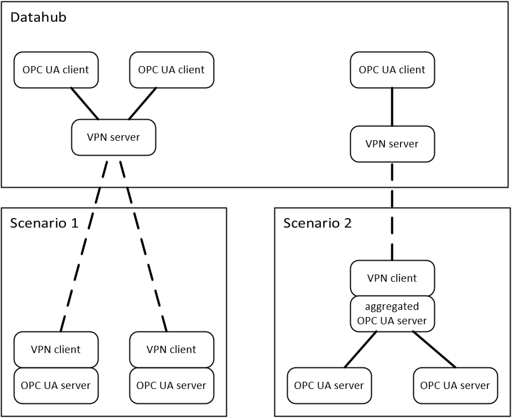

# OPC UA Server Requirements

## Connecting an OPC UA server to the data hub via VPN

### Datahub and the fairconnect-configuration

For this showcase we will have a datahub provided off premise. This will act as an OPC UA aggregation server. The machine tools (M) will connect via an OpenVPN tunnel to an VPN endpoint (one per partner). An OPC UA client will connect to the OPC UA server(s) of that partner through the VPN tunnel. The application providers (A) will connect to the datahub OPC UA server, as an [OPC UA Client](CLIENT.html).
To connect to this datahub (M) need an OPC UA server and OpenVPN client to access one dedicated endpoint per partner.
In order to ease the onboarding process onto the datahub, we provide the [fairconnect configuration page](https://fairconnect.umati.app) and a specified process for connecting OPC UA servers to the showcase:

#### Process summary for connecting an OPC UA server to the data hub via VPN

1. Fill in and sign the MoU as participant (M) and indicate which/how many machines you want to connect.
2. Install the OpenVPN client
3. Wait to receive an email with a link to register your machine on the datahub.
4. Click the link and set a password for the machine account
5. Login in [fairconnect](https://fairconnect.umati.app) to the machine account with the machine name and the password (Owner, Owner Email and machine name is set by us, but can be changed if necessary) 
6. Download your individual OpenVPN client configuration
7. Import the provided configuration and start the VPN connection on the OpenVPN client.
8. Insert the TCP port of the OPC UA Server
9. Check whether the connection has been set up correctly.
10. Select the NS(Namespace)-URIs of your instance to be imported (If you have an aggregating server with more than one machine, please select all relevant namespaces).
11. Start the integration and wait for it to complete. This will take a couple of minutes, if errors occur you will get an output. Please adjust your server/connectivity accordingly. When all checks are passed, the machine is added to the datahub.
12. Check if the machine appears in the datahub (meaning the OPC UA server that clients can connect to, please refer to the following chapter for connection details) and all values are correct.
13. There is a delay between adding machines to the datahub (the aggregated OPC UA server) until they are added to the dashboard (the browser-based app) as this is done manually by us. We aim to update about once a day.
14. Send an email to [info@umati.org](mailto:info@umati.org) with an image of the machine (Image will be compressed to 1100x800 if it&#39;s larger) and the Namespace URI of the machine in the datahub. This image will be used for the dashboard at [https://dashboard.umati.app](https://dashboard.umati.app/) . If you do not provide a picture, we will instead display a dummy machine icon.

### OpenVPN client

Each OPC UA server that should be connected to the datahub requires its own OpenVPN client (e.g. when there are two machine tools with an OPC UA server each, each one will require its own VPN client. When both OPC UA servers are aggregated to one OPC UA server, one VPN client for the aggregated server is sufficient, see following scenario graphs). The OpenVPN client can be downloaded here: [https://openvpn.net/community-downloads/](https://openvpn.net/community-downloads/). The OpenVPN client will make the computer accessible to the OPC UA client running on the data hub. Each participant will connect to their own VPN server endpoint.

#### OpenVPN configuration

Each participant will receive as many OpenVPN configuration as requested in the MoU by the datahub provider. Each configuration can be used for one VPN client instance. See the picture above for possible scenarios of multiple OPC UA servers/multiple machines of one participant. These configurations can be downloaded per machine at <https://fairconnect.umati.app> by all registered participants (M) who have indicated to connect machines with an OPC UA server. The VPN-connection requires an unrestricted outbound connection to **vpn.umati.app** using TCP 443.

#### OPC UA server/client connection

The OPC UA client runs on the datahub and is connected to the systems that runs the OpenVPN client. The OPC UA client connects to a specified port on this computer to establish a connection to the OPC UA server. The default port is 4840. You can set this port on the [fairconnect configuration page](https://fairconnect.umati.app).

The default OPC UA connection settings are (encryption is done by the VPN):

| Type | Setting |
| --- | :---: |
| Security Mode | None |
| Algorithm | None |
| User Authentication | Anonymous |

## OPC UA server functionalities

The functional requirements for the OPC UA server provided for the umati showcase demonstration are as follows.

Provide at least the OPC 40001-1 UA for Machinery namespance and a instance namespace of your machine.

The minimal required profiles according to the OPC UA Specification Part 7 are listed below:

- Micro Embedded Device 2017 Server Profile this includes:
  - 2 Sessions
  - Attribute Read
  - Ua Binary Encoding
  - Core 2017 Server Facet
    - Authentication by username and password
    - TCP Binary
- Enhanced DataChange Subscription 2017 Server Facet (500 Monitored Items) (Model might contain more than 100 nodes)
- Data Access Server Facet
  - With mandatory &quot;Data Access AnalogItems&quot; as OverrideItemType is a subtype of AnalogItemType

## Getting started: OPC UA server for umati showcase

This manual focuses on the special features that are relevant when creating an umati OPC UA server for the fair demonstration. The general points about the OPC UA servers are not discussed in detail, e.g. how the data is linked with the OPC UA address space.

In this chapter the necessary adaptations of the OPC UA information model, some important points about the running OPC UA server and the connection to the data center will be described in short.

### OPC UA server

- Load at least the Machinery types (as defined by OPC 40001-1 UA for Machinery) and the adapted instances in two separate namespaces into the OPC UA server.
- Ensure that all variables have valid values, if a variable could not be provided by the machine tool, set a neutral value. (E.g. if no override is available, set the value to 1).

### OPC UA Server connecting to the datahub

1. Please ensure corresponding UMATI-relevant namespace is added to the server.

2. `Machines` folder have to point to base Machinery namespace, <http://opcfoundation.org/UA/Machinery>
This is where the datahub-connectors would look for showcase-relevant instances.

3. Only the following namespaces are accepted as well as understood by the Datahub.

   - <http://opcfoundation.org/UA/>
   - <http://opcfoundation.org/UA/DI/>
   - <http://vdw.de/protoyping/> (optional)
   - <http://opcfoundation.org/UA/IA/>
   - <http://opcfoundation.org/UA/IA#Prototyping/> (optional)
   - <http://opcfoundation.org/UA/Machinery/>
   - <http://opcfoundation.org/UA/MachineTool#Prototyping/> (optional)
   - <http://opcfoundation.org/UA/MachineTools/>
   - `your custom namespace(s) for you instance(s)`

   (optional: to enable use of an UA base NodeSet without the added *OrderedListType* object, needed by the IA and MachineTools release candidate specifications)

4. If the computer, where the OpenVPN Client runs is accessible, try connecting to your OPC UA Server via the Open VPN IP-address (begins with 10.80.0.). If no OPC UA Client is available on this computer, basic connection test can also be done by using telnet, by `telnet 10.80.0.XX 4840` .
5. When the OPC UA Server and the VPN-Connection is established, visit [https://fairconnect.umati.app](https://fairconnect.umati.app/) to check your connection and integrate the machine to the datahub.

## Aggregating multiple umati OPC UA servers

The aggregation should be equivalent to an aggregation that implement the [Device Information Model Specification](https://reference.opcfoundation.org/v104/DI/v102/docs/5.9/).

We define a well-known entry point (Machines, nsu=<http://opcfoundation.org/UA/Machinery>;i=1001), which contains all Machinery-Instances (normally one, but there might be several).

one machine tool:

These two address spaces should be merged so that in the aggregated server there is only one MachineTools-Folder and each Machine is under this node with the same NodeId-Identifiers und NodeId-URI (the NodeId-Index will be different) as in the original OPC UA server.

The required namespaces for Machinery and MachineTools (see 4. above) is only loaded once in the aggregated server.

