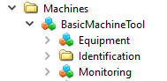
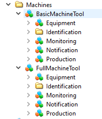

# OPC UA Server Requirements

## Connecting an OPC UA server to umati.app

### Process summary for connecting an OPC UA server to the [umati.app](https://umati.app)

1. Fill in and sign the MoU as participant and indicate which/how many machines you want to connect.
2. Receive an email with your MQTT broker credentials
3. Prepare a `configuration.json` as per documentation at [Gateway Config](Gateway.md)
4. Run a local OPC UA to MQTT over Websockets gateway
5. Check whether the connection to the MQTT broker is working and your gateway is publishing data
6. There is a delay between start of publishing of machine data to the broker until they are added to the dashboard. (the browser-based umati.app) as this takes a couple of minutes to propagate to the system.
7. Send an email to [info@umati.org](mailto:info@umati.org) with an image of the machine (PNG / 1000x800 pixel or larger) and the Namespace URI of the machine in the datahub. This image will be used for the dashboard at [https://umati.app](https://umati.app/) . If you do not provide a picture, we will instead display a generic machine icon.

## OPC UA server functionalities

The functional requirements for the OPC UA server provided for the umati showcase demonstration are as follows.

Provide at least the OPC 40001-1 UA for Machinery namespace and a instance namespace of your machine.

The minimal required profiles according to the OPC UA Specification Part 7 are listed below:

- Micro Embedded Device 2017 Server Profile this includes:
  - 2 Sessions
  - Attribute Read
  - Ua Binary Encoding
  - Core 2017 Server Facet
    - Authentication by username and password
    - TCP Binary
- Enhanced DataChange Subscription 2017 Server Facet (500 Monitored Items) (Model might contain more than 100 nodes)
- Data Access Server Facet
  - With mandatory &quot;Data Access AnalogItems&quot; as OverrideItemType is a subtype of AnalogItemType

## Getting started: OPC UA server for umati showcase

This manual focuses on the special features that are relevant when creating an umati OPC UA server for this fair demonstration. The general points about the OPC UA servers are not discussed in detail, e.g. how the data is linked with the OPC UA address space.

In this chapter the necessary adaptations of the OPC UA information model, some important points about the running OPC UA server and the connection to the datahub will be described in short.

### OPC UA server

- Load at least the Machinery types (as defined by OPC 40001-1 UA for Machinery) and the adapted instances in two separate namespaces into the OPC UA server.
- Ensure that all variables have valid values, if a variable could not be provided by the machine tool, set a neutral value. (e.g. if no override is available, set the value to 1).

### Aggregating multiple OPC UA servers

The aggregation should be equivalent to an aggregation that implement the [Device Information Model Specification](https://reference.opcfoundation.org/v104/DI/v102/docs/5.9/).

We define a well-known entry point (Machines, nsu=<http://opcfoundation.org/UA/Machinery>;i=1001), which contains all Machinery-Instances (normally one, but there might be several).

one machine tool:

These two address spaces should be merged so that in the aggregated server there is only one Machines-Folder and each Machine instance is under this node with the same NodeId-Identifiers und NodeId-URI (the NodeId-Index will be different) as in the originating OPC UA server.

The required namespaces for Machinery and related Companion Specifcations is only loaded once in the aggregated server.

