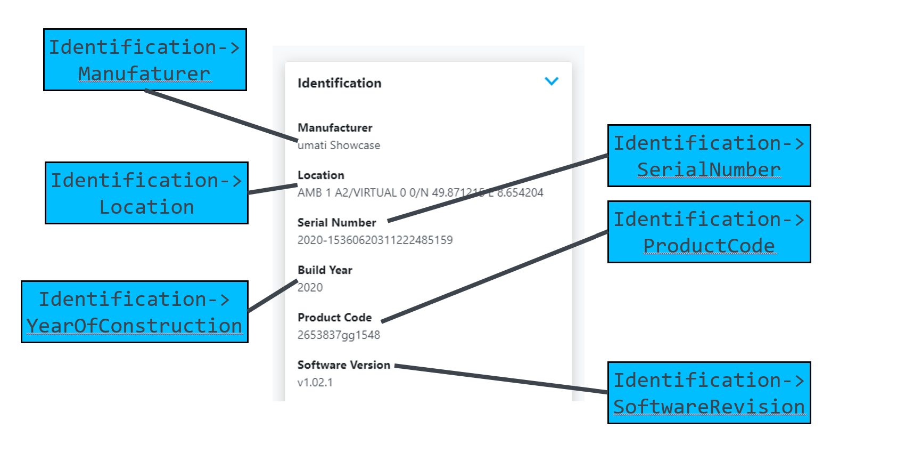

# umati showcase information model for Machine Tools

In the following the umati showcase describes the additional information on top of the [OPC 40501-1 UA for MachineTools](https://opcua.vdma.org/catalog-detail/-/catalog/3914) companion specification.

Please refer to the provided xml-Nodesets or UaModeler-project for exemplary implementation.

## Changes/Deletions/Exceptions to the release candidate information model

The following describes the umati showcase information model for Machine Tools.

For participants that are familiar with the information model, we have included comments and descriptions about changes between the release candidate information model and the showcase information model.

All participants not familiar with the release candidate information model do not need to review these changes in detail but rather follow the described model and refer to the provided xml Nodeset files and UA modeler project.

### NodeSets for the showcase

[Release NodeSet](https://github.com/umati/MachineTool-Plugfest/tree/master/UaModelerProject)

[Protoyping NodeSet](https://github.com/umati/MachineTool-Plugfest/tree/master/UaModelerProtoyping)

**Remark:** You have to be umati partner and added to the access list. (Contact: [info@umati.org](mailto:info@umati.org))

### Prototyping vs Non-Prototyping Machine Tools Nodesets

The OPC UA companion specification for Machine Tools uses the *OrderedListType*, which was introduced in [OPC 10001-13 / Errata 1.04.7](https://reference.opcfoundation.org/v104/Core/docs/Amendment13/).
This specific nodeset can only be integrated to an OPC UA server, which also supports this amendment. As severals SDKs and toolchains are not yet updated to 1.04.7 and do not allow the exchange of namespace 0, we provide the prototyping nodeset which is compatible to all 1.04 Servers. The prototyping nodeset introduces an additional namespace `http://vdw.de/protoyping/`, which adds the required ObjectTypes of the amendment to the address space.

To determine if your toolchain is compatible with the OPC UA companion specification for Machine Tools specification, check for the *OrderedListType* (NodeId `ns0;i=23518`) and have a look at `Root->Objects->Server->Namespaces->http://opcfoundation.org/UA/->NamespaceVersion` (NodeId: `ns0;i=15959`) whether the version is greater or equal to 1.04.7. If the toolchain is not compatible, stick with the prototyping nodeset for the showcase.

The prototyping nodeset is only supported for the upcoming showcases in 2020 and the **support of the prototyping nodeset may be dropped for further showcases** in 2021 when a reasonable amount of SDKs have been updated.

## General information valid for the umati showcase demonstration

| **DISCLAIMER** | For all applications the OPC UA server is to be configured without predefined NodeIDs for the instances. Clients will need to browse Instances or translate BrowsePaths find the NodeID for accessing the address space and available instances. |
| --- | --- |

### Identification data

The identification for machine tools are inherited from the Machinery companion specification.
To fill the demo dashboard machine page with the most content the variables marked with a **strong mandatory** should be provided if you like to look the machine identification nicely.

#### [**MachineIdentificationType Definition**](https://opcua.vdma.org/catalog-detail/-/catalog/3803)

| **Attribute** | **Value** |     |     |     |     |
| --- | --- | --- | --- | --- | --- |
| BrowseName | MachineIdentificationType |
| IsAbstract | False |
| Description | Contains information about the identification and nameplate of a machine |
|     |     |     |     |     |     |
| **References** | **Node Class** | **BrowseName** | **DataType** | **TypeDefinition** | **Other** |
| Subtype of the 2:FunctionalGroupType defined in OPC 10000-100, i.e. inheriting the InstanceDeclarations of that Node. |
| 0:HasProperty | Variable | 0:DefaultInstanceBrowseName | 0:QualifiedName | 0:PropertyType |     |
| 0:HasInterface | ObjectType | IMachineVendorNameplateType |
| 0:HasInterface | ObjectType | IMachineTagNameplateType |
| Applied from IMachineVendorNameplateType |     |     |     |     |     |
| 0:HasProperty | Variable | 2:ProductInstanceUri | 0:String | 0:PropertyType | M, RO |
| 0:HasProperty | Variable | 2:Manufacturer | 0:LocalizedText | 0:PropertyType | M, RO |
| 0:HasProperty | Variable | 2:ManufacturerUri | 0:String | 0:PropertyType | O, RO |
| 0:HasProperty | Variable | **2:Model** | 0:LocalizedText | 0:PropertyType | **M**, RO |
| 0:HasProperty | Variable | **2:ProductCode** | 0:String | 0:PropertyType | **M**, RO |
| 0:HasProperty | Variable | 2:HardwareRevision | 0:String | 0:PropertyType | O, RO |
| 0:HasProperty | Variable | **2:SoftwareRevision** | 0:String | 0:PropertyType | **M**, RO |
| 0:HasProperty | Variable | 2:DeviceClass | 0:String | 0:PropertyType | O, RO |
| 0:HasProperty | Variable | 2:SerialNumber | 0:String | 0:PropertyType | M, RO |
| 0:HasProperty | Variable | **YearOfConstruction** | UInt16 | 0:PropertyType | **M**, RO |
| 0:HasProperty | Variable | MonthOfConstruction | Byte | 0:PropertyType | O, RO |
| 0:HasProperty | Variable | InitialOperationDate | DateTime | 0:PropertyType | O, RO |
| Applied from IMachineTagNameplateType |     |     |     |     |     |
| 0:HasProperty | Variable | 2:AssetId | 0:String | 0:PropertyType | O, RW |
| 0:HasProperty | Variable | 2:ComponentName | 0:LocalizedText | 0:PropertyType | O, RW |
| 0:HasProperty | Variable | **Location** | 0:String | 0:PropertyType | **M**, RW |

#### Special requirements for correct locating on the dashboard

The instance Location shall be provided in the format `<fair> <hall> <booth>`, e.g, “METAV 1 A22” or format `<N/S> <Latitude|##.#########> <EW> <Longitude|###.#########>`, e.g. `N 51.257315 E 6.740885`

If the machine shall be referenced to more than one fair, provide a list of fair location, deliminated by slash e.g. `METAV <XXX> <XXX>/EMO 12 D17/N 51.257315 E 6.740885`

#### FAIR Shortnames

Fair shortnames are defined [here.](Fairs.md)

### Adaption of the provided information models for your purpose

- The provided NodeSet contains the address space with the ObjectTypes, VariableTypes and DataTypes of the MachineTools companion specificaion and **must not** be changed.
- Change the URI of the instance namespace (optional, but recommended)

  `http://www.<MANUFACTURERDOMAIN>/example`

- The rules for creating a URI can be found online. Please follow [this link](https://en.wikipedia.org/wiki/Uniform_Resource_Identifier). In the case of a website as a URI, it is not necessary that the website actually exists, it only identifies the machine uniquely. In order to simplify debugging it is recommended to choose a URI which allows an identification of the machine also for third persons, e.g. by including the company name.

- The machine will get a unique NamespaceURI after being integrated to the datahub by addition of a suffix to ensure unique namespaces.

- **Change the BrowseName and DisplayName of MachineTool** to `Company (short only alphanumeric)-Machine Name (alphanumeric)`, e.g. `ISW-TestServerMachine` or `ISW-SharpDriller5000. This helps a human to identify the machine in the aggregated server. **Do not use any other characters than {A…Z, a…z, 0…9} for the name**. Skipping this step prevents an automated integration to the dashboard.

## Value mapping between OPC UA companion specification and umati.app MachineTool

### Machine Tool - Overview

### Active Program Statusbar

For the status overview in the dashboard, the *State* of the *ProductionActiveProgramType* is stored and plotted over time. The status bar **does NOT relate to the stacklight** status!

Each status is assigned to a color, the color scheme is here (subject to change):

| State | Color |
| --- | --- |
| Initializing | &#9898; Gray |
| Running | &#128994; Green |
| Ended | &#128309; Cyan |
| Interrupted | &#128992; Orange |
| Aborted | &#128308; Red |
| Any other (unspecified) state | &#9899; Black |

A gap is left for periods of time in which no data was recorded (e.g. machine offline). An exemplary timeline is shown above.

### Machine Tool - Identification

### Machine Tool - Equipment - Tools

### Machine Tool - Active Program

### Machine Tool - Monitoring

