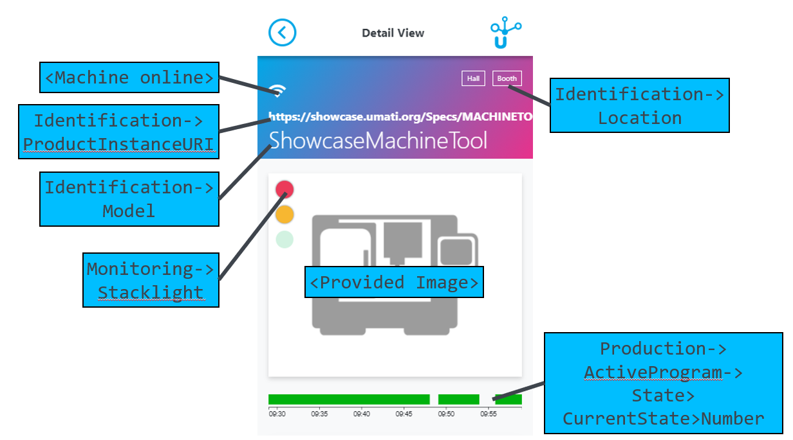
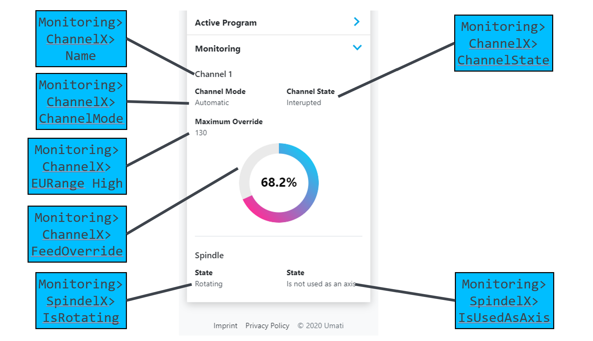

# umati showcase information model for Machine Tools

In the following the umati showcase describes the additional information on top of the [OPC 40501-1 UA for MachineTools](https://opcua.vdma.org/catalog-detail/-/catalog/3914) companion specification.

Please refer to the provided xml-Nodesets or UaModeler-project for exemplary implementation.

## Changes/Deletions/Exceptions to the released information model

The following describes the umati showcase information model for Machine Tools.

For participants that are familiar with the information model, we have included comments and descriptions about changes between the released information model and the showcase information model.

All participants not familiar with the released information model do not need to review these changes in detail but rather follow the described model and refer to the provided xml Nodeset files and UA modeler project.

### NodeSets

[Normative NodeSet hosted by the OPC Foundation](https://github.com/OPCFoundation/UA-Nodeset/tree/v1.04/MachineTool)

### For umati Machine Tool partners

[UaModeler Project](https://github.com/umati/MachineTool-Plugfest/tree/master/UaModelerProject) as a quick start ( **Remark:** You have to be umati partner and added to the access list. (Contact: [info@umati.org](mailto:info@umati.org)))

## General information valid for the umati showcase demonstration

| **DISCLAIMER** | For all applications the OPC UA server is to be configured without predefined NodeIds for the instances. Clients need to utilize the Services [Browse](https://reference.opcfoundation.org/Core/docs/Part4/5.8.2/) and [TranslateBrowsePathsToNodeIds](https://reference.opcfoundation.org/Core/docs/Part4/5.8.4/) to access nodes of interest. |

---

### Identification data

The identification for Machine Tools are inherited from the Machinery companion specification.
To fill the demo dashboard machine page with the most content the variables marked with a **strong mandatory** should be provided if you like to look the machine identification nicely.

#### [**MachineIdentificationType Definition**](https://reference.opcfoundation.org/Machinery/docs/8.6/)

| **Attribute** | **Value** |     |     |     |     |
| --- | --- | --- | --- | --- | --- |
| BrowseName | MachineIdentificationType |
| IsAbstract | False |
| Description | Contains information about the identification and nameplate of a machine |
|     |     |     |     |     |     |
| **References** | **Node Class** | **BrowseName** | **DataType** | **TypeDefinition** | **Other** |
| Subtype of the 2:FunctionalGroupType defined in OPC 10000-100, i.e. inheriting the InstanceDeclarations of that Node. |
| 0:HasProperty | Variable | 0:DefaultInstanceBrowseName | 0:QualifiedName | 0:PropertyType |     |
| 0:HasInterface | ObjectType | IMachineVendorNameplateType |
| 0:HasInterface | ObjectType | IMachineTagNameplateType |
| Applied from IMachineVendorNameplateType |     |     |     |     |     |
| 0:HasProperty | Variable | 2:ProductInstanceUri | 0:String | 0:PropertyType | M, RO |
| 0:HasProperty | Variable | 2:Manufacturer | 0:LocalizedText | 0:PropertyType | M, RO |
| 0:HasProperty | Variable | 2:ManufacturerUri | 0:String | 0:PropertyType | O, RO |
| 0:HasProperty | Variable | **2:Model** | 0:LocalizedText | 0:PropertyType | **M**, RO |
| 0:HasProperty | Variable | **2:ProductCode** | 0:String | 0:PropertyType | **M**, RO |
| 0:HasProperty | Variable | 2:HardwareRevision | 0:String | 0:PropertyType | O, RO |
| 0:HasProperty | Variable | **2:SoftwareRevision** | 0:String | 0:PropertyType | **M**, RO |
| 0:HasProperty | Variable | 2:DeviceClass | 0:String | 0:PropertyType | O, RO |
| 0:HasProperty | Variable | 2:SerialNumber | 0:String | 0:PropertyType | M, RO |
| 0:HasProperty | Variable | **YearOfConstruction** | UInt16 | 0:PropertyType | **M**, RO |
| 0:HasProperty | Variable | MonthOfConstruction | Byte | 0:PropertyType | O, RO |
| 0:HasProperty | Variable | InitialOperationDate | DateTime | 0:PropertyType | O, RO |
| Applied from IMachineTagNameplateType |     |     |     |     |     |
| 0:HasProperty | Variable | 2:AssetId | 0:String | 0:PropertyType | O, RW |
| 0:HasProperty | Variable | 2:ComponentName | 0:LocalizedText | 0:PropertyType | O, RW |
| 0:HasProperty | Variable | **Location** | 0:String | 0:PropertyType | **M**, RW |

#### Special requirements for correct location of the machine icon on the dashboard

The instance _Location_ property is evaluated according to the special requirements detailed [here](DASHBOARD.md#location-of-fair-machine-and-software-icons-on-the-dashboard) to place a map icon for the machine.

### Adaption of the provided information models for your purpose

- The provided NodeSet contains the address space with the ObjectTypes, VariableTypes and DataTypes of the MachineTools companion specification and **must not** be changed.
- Change the URI of the instance namespace (optional, but recommended)

  `http://www.<MANUFACTURERDOMAIN>/example`

- The rules for creating a URI can be found online. Please follow [this link](https://en.wikipedia.org/wiki/Uniform_Resource_Identifier). In the case of a website as a URI, it is not necessary that the website actually exists, it only identifies the machine uniquely. In order to simplify debugging it is recommended to choose a URI which allows an identification of the machine also for third persons, e.g. by including the company name.

- The machine will get a unique NamespaceURI after being integrated to the datahub by addition of a suffix to ensure unique namespaces.

## Value mapping between OPC UA companion specification and umati.app MachineTool page

### Machine Tool - Overview

### Active Program Statusbar

For the status overview in the dashboard, the *State* of the *ProductionActiveProgramType* is stored and plotted over time. The status bar **does NOT relate to the stacklight** status!

Each status is assigned to a color, the color scheme is here (subject to change):

| State | Color |
| --- | --- |
| Initializing | &#9898; Gray |
| Running | &#128994; Green |
| Ended | &#128309; Cyan |
| Interrupted | &#128992; Orange |
| Aborted | &#128308; Red |
| Any other (unspecified) state | &#9899; Black |

A gap is left for periods of time in which no data was recorded (e.g. machine offline). An exemplary timeline is shown above.

### Machine Tool - Identification

### Machine Tool - Equipment - Tools

### Machine Tool - Active Program

### Machine Tool - Monitoring (Machine Tool / Channel)

### Machine Tool - Monitoring (Working Units)

