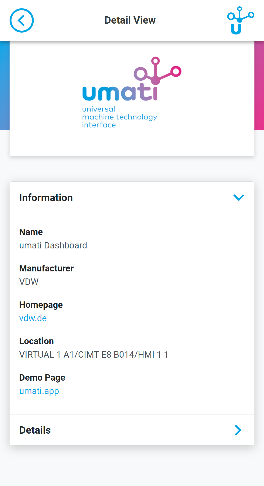
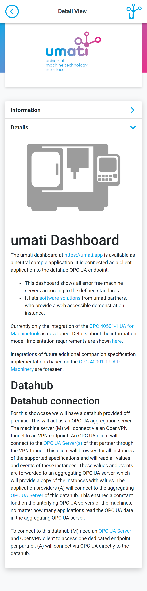

# How to display a software product in the umati dashboard

You are a software vendor, who creates and markets dashboarding or similiar applications.
Then you can showcase you products also through the umati.app.

Going forward we will create software products as a separate listing inside the umati.app.
So an user of the app, will not only be able to browse connected machines but also software solutions.

## What informations will be provided to a prospect

- **Manufacturer**
- URL of the manufacturer/product site
- **Productname**
- URL of a running product instance (accessible demonstration instance, connected to the datahub, - showcaseing the connected machines)
- Software icon
- Software screenshot (min 1024x768px PNG)
- Short description of the product (1000 char)
- Fair location (hall / booth) multiple assignments in the future
- GPS location to place the marker on the map to

For the upcoming fairs this list will be filled manual by the fair organizer, after you provide the information and are registered for the fair.

This list will be selfmanagable going forward.

## Software - Overview (example)

## Software - Detail (example)

