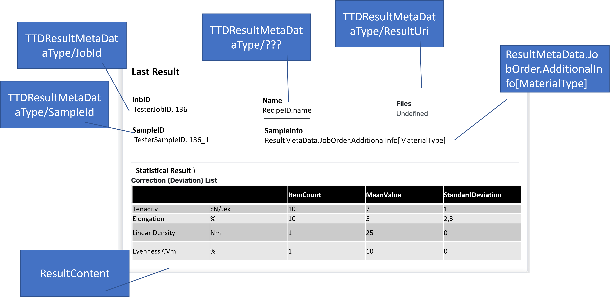

# umati showcase information model for Textile Testing Devices

In the following the umati showcase describes the additional information on top
of the [OPC 40444 UA for Textile Testing Devices](https:/umati.org/ua4ttd) companion specification.

Please refer to the provided XML-NodeSets, UaModeler-project or the [TTD
repos](https://github.com/umati/TTD) for exemplary implementation.

## NodeSets

[NodeSet](https://github.com/OPCFoundation/UA-Nodeset/tree/latest/TTD)

## General information valid for the umati showcase demonstration

| **DISCLAIMER** | For all applications the OPC UA server is to be configured
without predefined NodeIds for the instances. Clients need to utilize the
Services [Browse](https://reference.opcfoundation.org/Core/docs/Part4/5.8.2/)
and
[TranslateBrowsePathsToNodeIds](https://reference.opcfoundation.org/Core/docs/Part4/5.8.4/)
to access nodes of interest. |

### Identification data

The identification for textile testing devices is inherited from the Machinery
companion specification. To fill the demo dashboard machine page with the most
content the variables marked with a **strong mandatory** should be provided if
you like to look the machine identification nicely.

#### [**MachineIdentificationType Definition**](https://reference.opcfoundation.org/Machinery/docs/8.6/)

| **Attribute**                                                                                                         | **Value**                                                                |                             |                 |                    |           |
| --------------------------------------------------------------------------------------------------------------------- | ------------------------------------------------------------------------ | --------------------------- | --------------- | ------------------ | --------- |
| BrowseName                                                                                                            | MachineIdentificationType                                                |                             |                 |                    |           |
| IsAbstract                                                                                                            | False                                                                    |                             |                 |                    |           |
| Description                                                                                                           | Contains information about the identification and nameplate of a machine |                             |                 |                    |           |
|                                                                                                                       |                                                                          |                             |                 |                    |           |
| **References**                                                                                                        | **NodeClass**                                                            | **BrowseName**              | **DataType**    | **TypeDefinition** | **Other** |
| Subtype of the 2:FunctionalGroupType defined in OPC 10000-100, i.e. inheriting the InstanceDeclarations of that Node. |                                                                          |                             |                 |                    |           |
| 0:HasProperty                                                                                                         | Variable                                                                 | 0:DefaultInstanceBrowseName | 0:QualifiedName | 0:PropertyType     |           |
| 0:HasInterface                                                                                                        | ObjectType                                                               | IMachineVendorNameplateType |                 |                    |           |
| 0:HasInterface                                                                                                        | ObjectType                                                               | IMachineTagNameplateType    |                 |                    |           |
| Applied from IMachineVendorNameplateType                                                                              |                                                                          |                             |                 |                    |           |
| 0:HasProperty                                                                                                         | Variable                                                                 | 2:ProductInstanceUri        | 0:String        | 0:PropertyType     | M, RO     |
| 0:HasProperty                                                                                                         | Variable                                                                 | 2:Manufacturer              | 0:LocalizedText | 0:PropertyType     | M, RO     |
| 0:HasProperty                                                                                                         | Variable                                                                 | 2:ManufacturerUri           | 0:String        | 0:PropertyType     | O, RO     |
| 0:HasProperty                                                                                                         | Variable                                                                 | **2:Model**                 | 0:LocalizedText | 0:PropertyType     | **M**, RO |
| 0:HasProperty                                                                                                         | Variable                                                                 | **2:ProductCode**           | 0:String        | 0:PropertyType     | **M**, RO |
| 0:HasProperty                                                                                                         | Variable                                                                 | 2:HardwareRevision          | 0:String        | 0:PropertyType     | O, RO     |
| 0:HasProperty                                                                                                         | Variable                                                                 | **2:SoftwareRevision**      | 0:String        | 0:PropertyType     | **M**, RO |
| 0:HasProperty                                                                                                         | Variable                                                                 | 2:DeviceClass               | 0:String        | 0:PropertyType     | O, RO     |
| 0:HasProperty                                                                                                         | Variable                                                                 | 2:SerialNumber              | 0:String        | 0:PropertyType     | M, RO     |
| 0:HasProperty                                                                                                         | Variable                                                                 | **YearOfConstruction**      | UInt16          | 0:PropertyType     | **M**, RO |
| 0:HasProperty                                                                                                         | Variable                                                                 | MonthOfConstruction         | Byte            | 0:PropertyType     | O, RO     |
| 0:HasProperty                                                                                                         | Variable                                                                 | InitialOperationDate        | DateTime        | 0:PropertyType     | O, RO     |
| Applied from IMachineTagNameplateType                                                                                 |                                                                          |                             |                 |                    |           |
| 0:HasProperty                                                                                                         | Variable                                                                 | 2:AssetId                   | 0:String        | 0:PropertyType     | O, RW     |
| 0:HasProperty                                                                                                         | Variable                                                                 | 2:ComponentName             | 0:LocalizedText | 0:PropertyType     | O, RW     |
| 0:HasProperty                                                                                                         | Variable                                                                 | **Location**                | 0:String        | 0:PropertyType     | **M**, RW |

#### Special requirements for correct location of the machine icon on the dashboard

The instance _Location_ property is evaluated according to the special
requirements detailed [Dashboard feature](../Dashboard.md#location-of-fair-machine-and-software-icons-on-the-dashboard)
to place a map icon for the machine.

### Adaption of the provided information models for your purpose

- The provided NodeSet contains the address space with the ObjectTypes,
  VariableTypes and DataTypes of the MachineTools companion specification and
  **must not** be changed.
- Change the URI of the instance namespace (optional, but recommended)

  `http://www.<MANUFACTURERDOMAIN>/example`

- The rules for creating a URI can be found online. Please follow [this
  link](https://en.wikipedia.org/wiki/Uniform_Resource_Identifier). In the case
  of a URL as a URI, it is not necessary that the site actually exists,
  it only identifies the machine uniquely. In order to simplify debugging it is
  recommended to choose a URI which allows an identification of the machine also
  for third persons, e.g., by including the company name.

## Value mapping between OPC UA companion specification and umati.app MachineTool page

### TTD- Overview

Hint: TTD has not stacklight so it is not shown

### TTD - Identification

### TTD - Active Program

### TTD - Results

