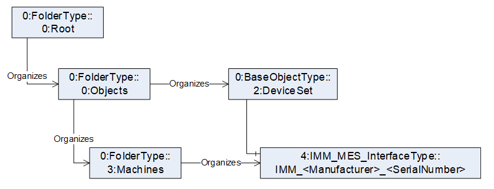

# umati showcase information model for Plastics and Rubber machines OPC 40077

## 1. General

The namespace for the instances is manufacturer specific, e.g. <http://samplemanufacturer.com/umati_sample_IMM_instance/>

Table 2 shows the complete structure of the instance needed for the umati demonstrator. The demonstrator requires, that all mandatory elements of the _IMM_MES_InterfaceType_ are existent, even if there are not displayed in the dashboard. If the value of a variable a not displayed, is can be filled with a static dummy value (e.g. empty string). All displayed values are marked in **bold**.

Important: In OPC 40077 it is defined, that the instance of the _IMM_MES_InterfaceType_ is located under the Object DeviceSet. For umati it is necessary to add it under the _Machines_ folder defined by OPC UA for machinery. In practice it is not necessary to create a new instance. It is sufficient to have an Organizes Reference from the Machines folder to the instance located under DeviceSet

In addition, OPC 40077 uses the MachineInformationType defined in OPC 40083. For participation in the umati demonstrator it is necessary to create in parallel an instance of the MachineIdentificationType defined in OPC UA for Machinery.

Download: [Compleate documentation umati showcase information model Plastics and Rubber](https://github.com/umati/Showcase/tree/main/img/PlasticsRubber/PR_40077_PDF.pdf)

### Table 1 – Namespaces used in this document

| **NamespaceURI**                                           | **Namespace Index** | **Example**                                                                        |
| :--------------------------------------------------------- | :------------------ | :--------------------------------------------------------------------------------- |
| <http://opcfoundation.org/UA/>                             | 0                   | 0:NodeVersion                                                                      |
| <http://opcfoundation.org/UA/PlasticsRubber/IMM2MES/>      | 1                   | _Default namespace of OPC 40077_ --> \_no prefix used, e.g.\_IMM_MES_InterfaceType |
| <http://opcfoundation.org/UA/DI/>                          | 2                   | 2:DeviceClass                                                                      |
| <http://opcfoundation.org/UA/PlasticsRubber/GeneralTypes/> | 3                   | 3:MachineInformationType                                                           |
| <http://opcfoundation.org/UA/Machinery>                    | 4                   | 4:MachineIdentificationType                                                        |

### Table 2 – Sample instance of IMM_MES_InterfaceType

<!-- textlint-disable -->

| **BrowseName**                                                             | **Type**                                  | **Example Value**                                                                                                                                              | **Remarks** |
| -------------------------------------------------------------------------- | :---------------------------------------- | :------------------------------------------------------------------------------------------------------------------------------------------------------------- | :---------- |
| Objects                                                                    |                                           |                                                                                                                                                                |             |
| &ensp;Machines                                                             |                                           |                                                                                                                                                                |             |
| &ensp;&ensp;IMM*&lt;Manufacturer>*&lt;SerialNumber>                        | IMM_MES_InterfaceType                     |                                                                                                                                                                |             |
| &ensp;&ensp;&ensp;2:Identification                                         | 4:MachineIdentificationType               |                                                                                                                                                                | 1)          |
| &ensp;&ensp;&ensp;&ensp;2:ProductInstanceUri                               |                                           | “<http://samplemanufacturer.com/IMM123>”                                                                                                                       | 2)          |
| &ensp;&ensp;&ensp;&ensp;**2:Manufacturer**                                 | 0:LocalizedText                           | “Sample Manufacturer”                                                                                                                                          |             |
| &ensp;&ensp;&ensp;&ensp;**2:Model**                                        | 0:LocalizedText                           | “Machine Model 3000”                                                                                                                                           | 3)          |
| &ensp;&ensp;&ensp;&ensp;**2:SerialNumber**                                 | 0:String                                  | “IMM123”                                                                                                                                                       |             |
| &ensp;&ensp;&ensp;&ensp;**2:DeviceClass**                                  | 0:String                                  | “Injection Moulding Machine”                                                                                                                                   |             |
| &ensp;&ensp;&ensp;&ensp;**4:Location**                                     | 0:String                                  | “K 14 F42/N 51.260407 E 6.744588”                                                                                                                              | 3), 4)      |
|                                                                            |                                           |                                                                                                                                                                |             |
| &ensp;&ensp;&ensp;MachineInformation                                       | 3:MachineInformationType                  |                                                                                                                                                                |             |
| &ensp;&ensp;&ensp;&ensp;2:DeviceClass                                      | 0:String                                  | “Injection Moulding Machine”                                                                                                                                   |             |
| &ensp;&ensp;&ensp;&ensp;2:Manufacturer                                     | 0:LocalizedText                           | “Sample Manufacturer”                                                                                                                                          |             |
| &ensp;&ensp;&ensp;&ensp;2:Model                                            | 0:LocalizedText                           | “Machine Model 3000”                                                                                                                                           |             |
| &ensp;&ensp;&ensp;&ensp;2:SerialNumber                                     | 0:String                                  | “IMM123”                                                                                                                                                       |             |
| &ensp;&ensp;&ensp;&ensp;3:ControllerName                                   | 0:String                                  | “My Controller”                                                                                                                                                | 2)          |
| &ensp;&ensp;&ensp;&ensp;3:SupportedLogbookEvents                           | 3:LogbookEventsEnumeration[]              | _empty array / NULL_                                                                                                                                           | 2)          |
|                                                                            |                                           |                                                                                                                                                                |             |
| &ensp;&ensp;&ensp;MachineConfiguration                                     | 3:MachineConfigurationType                |                                                                                                                                                                | 2)          |
| &ensp;&ensp;&ensp;&ensp;3:UserMachineName                                  | 0:String                                  | “My injection moulding machine”                                                                                                                                | 2)          |
| &ensp;&ensp;&ensp;&ensp;3:LocationName                                     | 0:String                                  | “K 14 F42/N 51.260407 E 6.744588”                                                                                                                              | 2)          |
| &ensp;&ensp;&ensp;&ensp;3:TimeZoneOffset                                   | 0:TimeZoneDataType                        | 
_offset_: 0

_daylightSavingInOffset:_ true
                                                                                                        | 2)          |
|                                                                            |                                           |                                                                                                                                                                |             |
| &ensp;&ensp;&ensp;MachineMESConfiguration                                  | 3:MachineMESConfigurationType             |                                                                                                                                                                | 2)          |
| &ensp;&ensp;&ensp;&ensp;3:StandstillReasons                                | 3:StandstillReasonType[]                  | _empty array / NULL_                                                                                                                                           | 2)          |
| &ensp;&ensp;&ensp;&ensp;3:StandstillReasonsLockedByMES                     | 0:Boolean                                 | false                                                                                                                                                          | 2)          |
|                                                                            |                                           |                                                                                                                                                                |             |
| &ensp;&ensp;&ensp;MachineStatus                                            | 3:MachineStatusType                       |                                                                                                                                                                |             |
| &ensp;&ensp;&ensp;&ensp;3:IsPresent                                        | 0:Boolean                                 | true                                                                                                                                                           | 2)          |
| &ensp;&ensp;&ensp;&ensp;**3:MachineMode**                                  | 3:MachineModeEnumeration                  | 1 (=AUTOMATIC)                                                                                                                                                 |             |
| &ensp;&ensp;&ensp;&ensp;3:Users                                            | 3:UsersType                               |                                                                                                                                                                | 2), 5)      |
| &ensp;&ensp;&ensp;&ensp;&ensp;0:NodeVersion                                | 0:String                                  | “1”                                                                                                                                                            | 2)          |
|                                                                            |                                           |                                                                                                                                                                |             |
| &ensp;&ensp;&ensp;MachineMESStatus                                         | 3:MachineMESStatusType                    |                                                                                                                                                                | 2)          |
| &ensp;&ensp;&ensp;3:StandstillReasonId                                     | 0:String                                  | “”                                                                                                                                                             | 2)          |
| &ensp;&ensp;&ensp;&ensp;3:StandstillMessage                                | 3:StandstillMessageType                   |                                                                                                                                                                | 2)          |
| &ensp;&ensp;&ensp;&ensp;&ensp;3:Id                                         | 0:String                                  | “”                                                                                                                                                             | 2)          |
| &ensp;&ensp;&ensp;&ensp;&ensp;0:Message                                    | 0:LocalizedText                           | “”                                                                                                                                                             | 2)          |
| &ensp;&ensp;&ensp;&ensp;&ensp;0:Severity                                   | 0:UInt16                                  | 0                                                                                                                                                              | 2)          |
| &ensp;&ensp;&ensp;&ensp;&ensp;3:Classification                             | 0:IMMMessageClassification Enumeration | 0 (= OTHER)                                                                                                                                                    | 2)          |
| &ensp;&ensp;&ensp;&ensp;3:MESMessage                                       | 3:MESMessageType                          |                                                                                                                                                                | 2)          |
| &ensp;&ensp;&ensp;&ensp;&ensp;3:Id                                         | 0:String                                  | “”                                                                                                                                                             | 2)          |
| &ensp;&ensp;&ensp;&ensp;&ensp;0:Message                                    | 0:LocalizedText                           | “”                                                                                                                                                             | 2)          |
| &ensp;&ensp;&ensp;&ensp;&ensp;0:Severity                                   | 0:UInt16                                  | 0                                                                                                                                                              | 2)          |
| &ensp;&ensp;&ensp;&ensp;3:ProductionControl                                | 3:ProductionControlType                   |                                                                                                                                                                | 2)          |
| &ensp;&ensp;&ensp;&ensp;&ensp;3:ProductionStatus                           | ProductionStatusEnumeration               | 4 (= PRODUCTION)                                                                                                                                               | 2)          |
| &ensp;&ensp;&ensp;&ensp;&ensp;3:ProductionReleasedByMES                    | 0:Boolean                                 | true                                                                                                                                                           | 2)          |
| &ensp;&ensp;&ensp;&ensp;&ensp;3:AutomaticRunEnabled                        | 0:Boolean                                 | true                                                                                                                                                           | 2)          |
|                                                                            |                                           |                                                                                                                                                                |             |
| &ensp;&ensp;&ensp;PowerUnits                                               | 3:PowerUnitsType                          |                                                                                                                                                                | 2), 5)      |
| &ensp;&ensp;&ensp;&ensp;0:NodeVersion                                      | 0:String                                  | “1”                                                                                                                                                            | 2)          |
|                                                                            |                                           |                                                                                                                                                                |             |
| &ensp;&ensp;&ensp;Moulds                                                   | 3:MouldsType                              |                                                                                                                                                                | 2), 5)      |
| &ensp;&ensp;&ensp;&ensp;0:NodeVersion                                      | 0:String                                  | “1”                                                                                                                                                            | 2)          |
|                                                                            |                                           |                                                                                                                                                                |             |
| &ensp;&ensp;&ensp;InjectionUnits                                           | 3:InjectionUnitsType                      |                                                                                                                                                                |             |
| &ensp;&ensp;&ensp;&ensp;0:NodeVersion                                      | 0:String                                  | “1”                                                                                                                                                            | 2)          |
| &ensp;&ensp;&ensp;&ensp;InjectionUnit_1                                    | 3:InjectionUnitType                       |                                                                                                                                                                | 3)          |
| &ensp;&ensp;&ensp;&ensp;&ensp;Index                                        | 0:UInt32                                  | 1                                                                                                                                                              | 2)          |
| &ensp;&ensp;&ensp;&ensp;&ensp;BarrelId                                     | 0:String                                  | “Barrel1”                                                                                                                                                      | 2)          |
| &ensp;&ensp;&ensp;&ensp;&ensp;IsPresent                                    | 0:Boolean                                 | true                                                                                                                                                           | 2)          |
| &ensp;&ensp;&ensp;&ensp;&ensp;InProduction                                 | 0:Boolean                                 | true                                                                                                                                                           | 2)          |
| &ensp;&ensp;&ensp;&ensp;&ensp;TemperatureZones                             | 3:TemperatureZonesType                    |                                                                                                                                                                |             |
| &ensp;&ensp;&ensp;&ensp;&ensp;&ensp;0:NodeVersion                          | 0:String                                  | “1”                                                                                                                                                            | 2)          |
| &ensp;&ensp;&ensp;&ensp;&ensp;&ensp;&ensp;BarrelTemperatureZone_1          | 3:BarrelTemperatureZoneType               |                                                                                                                                                                |             |
| &ensp;&ensp;&ensp;&ensp;&ensp;&ensp;&ensp;&ensp;3:Index                    | 0:UInt32                                  | 1                                                                                                                                                              | 2)          |
| &ensp;&ensp;&ensp;&ensp;&ensp;&ensp;&ensp;&ensp;**3:Name**                 | 0:String                                  | “Temperature Zone 1”                                                                                                                                           | 2)          |
| &ensp;&ensp;&ensp;&ensp;&ensp;&ensp;&ensp;&ensp;3:IsPresent                | 0:Boolean                                 | true                                                                                                                                                           | 2)          |
| &ensp;&ensp;&ensp;&ensp;&ensp;&ensp;&ensp;&ensp;3:ControlMode              | 3:ControlModeEnumeration                  | 2 (= AUTOMATIC)                                                                                                                                                | 2)          |
| &ensp;&ensp;&ensp;&ensp;&ensp;&ensp;&ensp;&ensp;3:NominalTemperature       | 0:AnalogItemType à 0:Double               | 120                                                                                                                                                            | 2)          |
| &ensp;&ensp;&ensp;&ensp;&ensp;&ensp;&ensp;&ensp;&ensp;EURange              | 0:Range                                   | 
_Low_: 0

_High_: 200
                                                                                                                              | 2)          |
| &ensp;&ensp;&ensp;&ensp;&ensp;&ensp;&ensp;&ensp;&ensp;EngineeringUnits     | 0:EUInformation                           | 
namespaceUri: “<http://www.opcfoundation.org/UA/units/un/cefact>”

unitId: 4408652

displayName: “°C”

description: “degree Celsius”
     | 2)          |
|                                                                            |                                           |                                                                                                                                                                |             |
| &ensp;&ensp;&ensp;&ensp;&ensp;&ensp;&ensp;&ensp;**3:ActualTemperature**    | 0:AnalogItemType à 0:Double               | 120.5                                                                                                                                                          |             |
| &ensp;&ensp;&ensp;&ensp;&ensp;&ensp;&ensp;&ensp;&ensp;**EURange**          | 0:Range                                   | 
_Low_: 0

_High_: 200
                                                                                                                              | 2)          |
| &ensp;&ensp;&ensp;&ensp;&ensp;&ensp;&ensp;&ensp;&ensp;**EngineeringUnits** | 0:EUInformation                           | 
namespaceUri: “<http://www.opcfoundation.org/UA/units/un/cefact>”

unitId: 4408652

**displayName: “°C”**

description: “degree Celsius”
 |             |
|                                                                            |                                           |                                                                                                                                                                |             |
| &ensp;&ensp;&ensp;&ensp;&ensp;&ensp;&ensp;&ensp;3:Position                 | 0:UInt32                                  | 1                                                                                                                                                              | 2)          |
|                                                                            |                                           |                                                                                                                                                                |             |
| &ensp;&ensp;&ensp;Jobs                                                     | 3:JobsType                                |                                                                                                                                                                | 3)          |
| &ensp;&ensp;&ensp;&ensp;ActiveJob                                          | 3:CyclicJobInformationType                |                                                                                                                                                                |             |
| &ensp;&ensp;&ensp;&ensp;&ensp;JobName                                      | 0:String                                  | “Order 12345”                                                                                                                                                  | 2)          |
| &ensp;&ensp;&ensp;&ensp;&ensp;JobDescription                               | 0:String                                  | “128000 screw caps 38mm”                                                                                                                                       | 2)          |
| &ensp;&ensp;&ensp;&ensp;&ensp;CustomerName                                 | 0:String                                  | “My customer”                                                                                                                                                  | 2)          |
| &ensp;&ensp;&ensp;&ensp;&ensp;ProductionDatasetName                        | 0:String                                  | “Cap Dataset 1”                                                                                                                                                | 2)          |
| &ensp;&ensp;&ensp;&ensp;&ensp;ProductionDatasetDescription                 | 0:String                                  | “Dataset for the production of screw cap 38mm”                                                                                                                 | 2)          |
| &ensp;&ensp;&ensp;&ensp;&ensp;Material                                     | 0:String**[]**                            | [“PE-HD”]                                                                                                                                                      | 2)          |
| &ensp;&ensp;&ensp;&ensp;&ensp;**ProductName**                              | 0:String**[]**                            | “screw cap 38mm”                                                                                                                                               |             |
| &ensp;&ensp;&ensp;&ensp;&ensp;ProductDescription                           | 0:String**[]**                            | “screw cap for PET bottels with 38mm diameter”                                                                                                                 | 2)          |
| &ensp;&ensp;&ensp;&ensp;&ensp;ContinueAtJobEnd                             | 0:Boolean                                 | false                                                                                                                                                          | 2)          |
| &ensp;&ensp;&ensp;&ensp;&ensp;NominalParts                                 | 0:UInt64                                  | 128000                                                                                                                                                         | 2)          |
|                                                                            |                                           |                                                                                                                                                                |             |
| &ensp;&ensp;&ensp;&ensp;ActiveJobValues                                    | 3:ActiveCyclicJobValuesType               |                                                                                                                                                                |             |
| &ensp;&ensp;&ensp;&ensp;&ensp;**JobStatus**                                | JobStatusEnumeration                      | 6 (= JOB_IN_PRODUCTION)                                                                                                                                        |             |
| &ensp;&ensp;&ensp;&ensp;&ensp;CurrentLotName                               | 0:String                                  | “Lot 123”                                                                                                                                                      | 2)          |
| &ensp;&ensp;&ensp;&ensp;&ensp;LastCycleTime                                | 0:Duration                                | 2400                                                                                                                                                           | 2)          |
| &ensp;&ensp;&ensp;&ensp;&ensp;**JobPartsCounter**                          | 0:UInt64                                  | 6400                                                                                                                                                           |             |
| &ensp;&ensp;&ensp;&ensp;&ensp;JobGoodPartsCounter                          | 0:UInt64                                  | 6390                                                                                                                                                           | 2)          |
| &ensp;&ensp;&ensp;&ensp;&ensp;JobBadPartsCounter                           | 0:UInt64                                  | 10                                                                                                                                                             | 2)          |
| &ensp;&ensp;&ensp;&ensp;&ensp;JobTestSamplesCounter                        | 0:UInt64                                  | 0                                                                                                                                                              | 2)          |

<!-- textlint-enable -->

1. Not included in OPC 40077 IMM_MES_InterfaceType. To be added in the instance
2. This variable is mandatory in the model but will not be displayed in the demonstrator
3. Not mandatory in OPC UA for Machinery but for this model and will be displayed in the demonstrator
4. See <https://showcase.umati.org/Dashboard.html#location-of-fair-machine-and-software-icons-on-the-dashboard> for rules for filling the location.
5. Container object is mandatory in the model, but no instances inside (besides Variable NodeVersion) needed.
