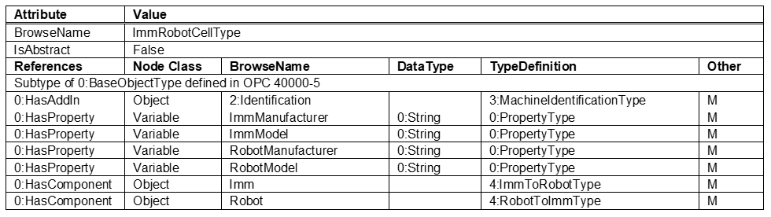
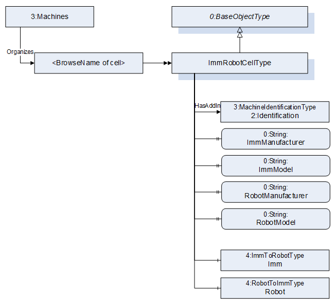

# umati showcase information model for Plastics and Rubber machines OPC 40079

## 1. General

The namespace for the instances is manufacturer specific, e.g. <http://samplemanufacturer.com/umati_sample_IMM_robot_cell/>

For integrating OPC 40079 in the umati demonstrator it is necessary to combine the models for the IMM (injection moulding machine) and the robot in one entry point for the cell. For this an additional model opc40079forumati.xml with the ObjectType ImmRobotCellType has been created:

### Table 1 – ImmRobotCellType Definition

### Figure 1 – ImmRobotCellType overview

The MachineIdentificationType is defined in OPC UA for Machinery. It includes basic information about a machine which are displayed in the umati dashboard (manufacturer, serial number, …).
To show the combination of IMM and robot, the cell is handles as one machine for the dashboard. To make the different manufacturers and models of IMM and robot visible in the overview, the variables Manufacturer and Model inside the Identification object shall be filled with both information. Examples:

Identification -> Manufacturer: “KraussMaffei / Kuka”

Identification -> Model: “GX G02 / KR CYBERTECH ARC”

In the detailed view of the cell, the manufacturers and model are displayed separately. For this, the Variables ImmManufacturer, ImmModel, RobotManufacturer and RobotModel are used. It is not required to have separate instances of the MachineIdentificationType for the IMM and the robot.

Download: [Compleate documentation umati showcase information model Plastics and Rubber](https://github.com/umati/Showcase/tree/main/img/PlasticsRubber/PR_40079_PDF.pdf)

Table 2 provides a list of namespaces and their index used for BrowseNames in this document.

### Table 2 – Namespaces used in this document

| **NamespaceURI**                                         | **Namespace Index** | **Example**                                                                       |
| :------------------------------------------------------- | :------------------ | :-------------------------------------------------------------------------------- |
| <http://opcfoundation.org/UA/>                           | 0                   | 0:NodeVersion                                                                     |
| <http://opcfoundation.org/UA/PlasticsRubber/umati/>      | 1                   | Default namespace of this specification --> no prefix used, e.g. ImmRobotCellType |
| <http://opcfoundation.org/UA/DI/>                        | 2                   | 2:DeviceClass                                                                     |
| <http://opcfoundation.org/UA/Machinery/>                 | 3                   | 3:MachineIdentificationType                                                       |
| <http://opcfoundation.org/UA/PlasticsRubber/ImmToRobot/> | 4                   | 4:ImmToRobotType                                                                  |

Table 3 shows the complete structure of the instance needed for the umati demonstrator. The demonstrator requires, that all mandatory elements of the ImmRobotCellType are existent, even if there are not displayed in the dashboard. If the value of a variable a not displayed, is can be filled with a static dummy value (e.g. empty string). All displayed values are marked in **bold**.

### Table 3 – Sample instance of ImmRobotCellType

| **BrowseName**                                                     | **Type**                    | **Example Value**                                     | **Remarks** |
| ------------------------------------------------------------------ | :-------------------------- | :---------------------------------------------------- | :---------- |
| Objects                                                            |                             |                                                       |             |
| &ensp;Machines                                                     |                             |                                                       |             |
| &ensp;&ensp;&ensp;<BrowseNameOfCell>                               | ImmRobotCellType            |                                                       |             |
| &ensp;&ensp;&ensp;&ensp;2:Identification                           | 4:MachineIdentificationType |                                                       |             |
| &ensp;&ensp;&ensp;&ensp;&ensp;2:ProductInstanceUri                 |                             | “<http://samplemanufacturer.com/Cell123>”             | 1)          |
| &ensp;&ensp;&ensp;&ensp;&ensp;**2:Manufacturer**                   | 0:LocalizedText             | “Sample IMM Manufacturer / Sample Robot Manufacturer” |             |
| &ensp;&ensp;&ensp;&ensp;&ensp;**2:Model**                          | 0:LocalizedText             | “Machine Model 3000 / Robot 99”                       | 2)          |
| &ensp;&ensp;&ensp;&ensp;&ensp;2:SerialNumber                       | 0:String                    | “Cell123”                                             | 1)          |
| &ensp;&ensp;&ensp;&ensp;&ensp;**4:Location**                       | 0:String                    | “K 14 F42/N 51.260407 E 6.744588”                     | 2), 3)      |
|                                                                    |                             |                                                       |             |
| &ensp;&ensp;&ensp;&ensp;**ImmManufacturer**                        | 0:String                    | “Sample IMM Manufacturer”                             |             |
| &ensp;&ensp;&ensp;&ensp;**ImmModel**                               | 0:String                    | “Machine Model 3000”                                  |             |
| &ensp;&ensp;&ensp;&ensp;**RobotManufacturer**                      | 0:String                    | “Sample Robot Manufacturer”                           |             |
| &ensp;&ensp;&ensp;&ensp;**RobotModel**                             | 0:String                    | “Robot 99””                                           |             |
|                                                                    |                             |                                                       |             |
| &ensp;&ensp;&ensp;&ensp;Imm                                        | 4:ImmToRobotType            |                                                       |             |
| &ensp;&ensp;&ensp;&ensp;&ensp;4:EndOfOrder                         | 0:Boolean                   | false                                                 | 1)          |
| &ensp;&ensp;&ensp;&ensp;&ensp;4:ImmOperationActive                 | 0:Boolean                   | true                                                  | 1)          |
| &ensp;&ensp;&ensp;&ensp;&ensp;4:PrepareForOperationWithImm         | 0:Boolean                   | true                                                  | 1)          |
| &ensp;&ensp;&ensp;&ensp;&ensp;**4:RobotMessageId_confirmed**       | 0:UInt32                    | 587                                                   |             |
| &ensp;&ensp;&ensp;&ensp;&ensp;Mould_1                              | 4:MouldType                 |                                                       |             |
| &ensp;&ensp;&ensp;&ensp;&ensp;&ensp;0:NodeVersion                  | 0:String                    | “1”                                                   | 1)          |
| &ensp;&ensp;&ensp;&ensp;&ensp;&ensp;4:MovablePlaten                | 4:ImmAxisType               |                                                       |             |
| &ensp;&ensp;&ensp;&ensp;&ensp;&ensp;&ensp;4:**InPosition1**        | 0:Boolean                   | false                                                 |             |
| &ensp;&ensp;&ensp;&ensp;&ensp;&ensp;&ensp;4:**InPosition2**        | 0:Boolean                   | true                                                  |             |
| &ensp;&ensp;&ensp;&ensp;&ensp;&ensp;&ensp;4:**Movement**           | 4:MovementEnum              | 0 (=NOT_MOVING)                                       |             |
|                                                                    |                             |                                                       |             |
| &ensp;&ensp;&ensp;&ensp;Robot                                      | 4:RobotToImmType            |                                                       |             |
| &ensp;&ensp;&ensp;&ensp;&ensp;4:OperationWithImmRequested          | 0:Boolean                   | true                                                  | 1)          |
| &ensp;&ensp;&ensp;&ensp;&ensp;**4:OperationWithImmActive**         | 0:Boolean                   | true                                                  |             |
| &ensp;&ensp;&ensp;&ensp;&ensp;4:ReadyForOperationWithImm           | 0:Boolean                   | true                                                  | 1)          |
| &ensp;&ensp;&ensp;&ensp;&ensp;**4:RobotMessageId**                 | 0:UInt32                    | 587                                                   |             |
| &ensp;&ensp;&ensp;&ensp;&ensp;MouldInteraction_1                   | 4:MouldInteractionType      |                                                       |             |
| &ensp;&ensp;&ensp;&ensp;&ensp;&ensp;**4:MouldAreaFree**            | 0:Boolean                   | true                                                  |             |
| &ensp;&ensp;&ensp;&ensp;&ensp;&ensp;4:EnableMovablePlaten          | 4:EnableImmAxisType         |                                                       |             |
| &ensp;&ensp;&ensp;&ensp;&ensp;&ensp;&ensp;4:RelevantForInteraction | 0:Boolean                   | true                                                  | 1)          |
| &ensp;&ensp;&ensp;&ensp;&ensp;&ensp;&ensp;**4:EnableToPosition1**  | 0:Boolean                   | true                                                  |             |
| &ensp;&ensp;&ensp;&ensp;&ensp;&ensp;&ensp;**4:EnableToPosition2**  | 0:Boolean                   | true                                                  |             |

1. This variable is mandatory in the model but will not be displayed in the demonstrator
2. Not mandatory in OPC UA for Machinery but for this model and will be displayed in the demonstrator
3. See <https://showcase.umati.org/Dashboard.html#location-of-fair-machine-and-software-icons-on-the-dashboard> for rules for filling the location.
