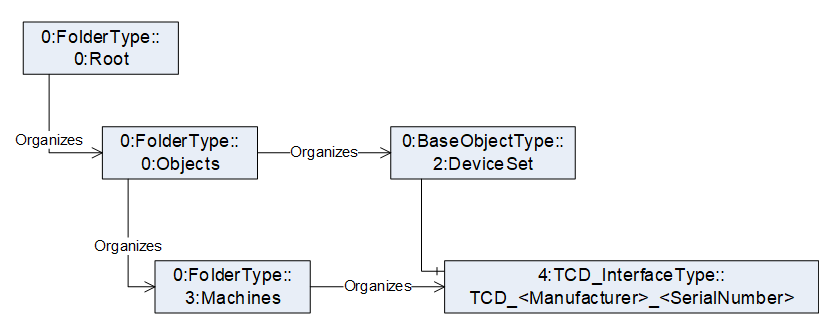

# umati showcase information model for Plastics and Rubber machines OPC 40082-1

## 1. General

The namespace for the instances is manufacturer specific, e.g. <http://samplemanufacturer.org/umati_opc40082-1_sample_instance/>

Table 2 shows the complete structure of the instance needed for the umati demonstrator. The demonstrator requires, that all mandatory elements of the TCD_InterfaceType are existent, even if there are not displayed in the dashboard. If the value of a variable a not displayed, is can be filled with a static dummy value (e.g. empty string). All displayed values are marked in **bold**.

Important: In OPC 40082-1 it is defined, that the instance of the TCD_InterfaceType is located under the Object DeviceSet. For umati it is necessary to add it under the Machines folder defined by OPC UA for machinery. In practice it is not necessary to create a new instance. It is sufficient to have an Organizes Reference from the Machines folder to the instance located under DeviceSet

In addition, OPC 40082-1 uses the MachineInformationType defined in OPC 40083. For participation in the umati demonstrator it is necessary to create in parallel an instance of the MachineIdentificationType defined in OPC UA for Machinery.

Download: [Compleate documentation umati showcase information model Plastics and Rubber](https://github.com/umati/Showcase/tree/main/img/PlasticsRubber/PR_40082-1_PDF.pdf)

### Table 1 – Namespaces used in this document

| **NamespaceURI**                                           | **Namespace Index** | **Example**                                                                 |
| :--------------------------------------------------------- | :------------------ | :-------------------------------------------------------------------------- |
| <http://opcfoundation.org/UA/>                             | 0                   | 0:NodeVersion                                                               |
| <http://opcfoundation.org/UA/PlasticsRubber/TCD/>          | 1                   | Default namespace of OPC 40082-1 --> no prefix used, e.g. TCD_InterfaceType |
| <http://opcfoundation.org/UA/DI/>                          | 2                   | 2:DeviceClass                                                               |
| <http://opcfoundation.org/UA/PlasticsRubber/GeneralTypes/> | 3                   | 3:MachineInformationType                                                    |
| <http://opcfoundation.org/UA/Machinery>                    | 4                   | 4:MachineIdentificationType                                                 |

### Table 2 – Sample instance of TCD_InterfaceType

| **BrowseName**                                                 | **Type**                    | **Example Value**                                                                                                                                                 | **Remarks** |
| -------------------------------------------------------------- | :-------------------------- | :---------------------------------------------------------------------------------------------------------------------------------------------------------------- | :---------- |
| Objects                                                        |                             |                                                                                                                                                                   |             |
| &ensp;Machines                                                 |                             |                                                                                                                                                                   |             |
| &ensp;&ensp;&ensp;TCD*&lt;Manufacturer>*&lt;SerialNumber>      | TCD_InterfaceType           |                                                                                                                                                                   |             |
| &ensp;&ensp;&ensp;&ensp;2:Identification                       | 4:MachineIdentificationType |                                                                                                                                                                   | 1)          |
| &ensp;&ensp;&ensp;&ensp;&ensp;2:ProductInstanceUri             |                             | “<http://samplemanufacturer.com/TCD1234>”                                                                                                                         | 2)          |
| &ensp;&ensp;&ensp;&ensp;&ensp;**2:Manufacturer**               | 0:LocalizedText             | “Sample Manufacturer”                                                                                                                                             |             |
| &ensp;&ensp;&ensp;&ensp;&ensp;**2:Model**                      | 0:LocalizedText             | “TCD 3000”                                                                                                                                                        | 3)          |
| &ensp;&ensp;&ensp;&ensp;&ensp;**2:SerialNumber**               | 0:String                    | “1234”                                                                                                                                                            |             |
| &ensp;&ensp;&ensp;&ensp;&ensp;**2:DeviceClass**                | 0:String                    | “Temperature Control Device”                                                                                                                                      |             |
| &ensp;&ensp;&ensp;&ensp;&ensp;**4:Location**                   | 0:String                    | “K 14 F42/N 51.260407 E 6.744588”                                                                                                                                 | 3), 4)      |
|                                                                |                             |                                                                                                                                                                   |             |
| &ensp;&ensp;&ensp;&ensp;Identification                         | 3:IdentificationType        |                                                                                                                                                                   | 2)          |
| &ensp;&ensp;&ensp;&ensp;&ensp;2:DeviceClass                    | 0:String                    | “Temperature Control Device”                                                                                                                                      | 2)          |
| &ensp;&ensp;&ensp;&ensp;&ensp;2:Manufacturer                   | 0:LocalizedText             | “Sample Manufacturer”                                                                                                                                             | 2)          |
| &ensp;&ensp;&ensp;&ensp;&ensp;2:Model                          | 0:LocalizedText             | “TCD 3000”                                                                                                                                                        | 2)          |
| &ensp;&ensp;&ensp;&ensp;&ensp;2:SerialNumber                   | 0:String                    | “1234”                                                                                                                                                            | 2)          |
|                                                                |                             |                                                                                                                                                                   |             |
| &ensp;&ensp;&ensp;&ensp;MachineConfiguration                   | 3:MachineConfigurationType  |                                                                                                                                                                   | 2)          |
| &ensp;&ensp;&ensp;&ensp;&ensp;3:UserMachineName                | 0:String                    | “My TCD”                                                                                                                                                          | 2)          |
| &ensp;&ensp;&ensp;&ensp;&ensp;3:LocationName                   | 0:String                    | “K 14 F42/N 51.260407 E 6.744588”                                                                                                                                 | 2)          |
| &ensp;&ensp;&ensp;&ensp;&ensp;3:TimeZoneOffset                 | 0:TimeZoneDataType          | 
_offset_: 0

_daylightSavingInOffset:_ true
                                                                                                           | 2)          |
|                                                                |                             |                                                                                                                                                                   |             |
| &ensp;&ensp;&ensp;&ensp;TCDSpecification                       | TCDSpecificationType        |                                                                                                                                                                   |             |
| &ensp;&ensp;&ensp;&ensp;&ensp;ConnectedLoad                    | 0:AnalogItemType à 0:Double | 10.2                                                                                                                                                              | 2)          |
| &ensp;&ensp;&ensp;&ensp;&ensp;&ensp;EURange                    | 0:Range                     | 
Low: 0

High: 20
                                                                                                                                      | 2)          |
| &ensp;&ensp;&ensp;&ensp;&ensp;&ensp;EngineeringUnits           | 0:EUInformation             | 
namespaceUri: “<http://www.opcfoundation.org/UA/units/un/cefact>”

unitId: 4937556

displayName: “kw”

description: “kilowatt”
              | 2)          |
| &ensp;&ensp;&ensp;&ensp;&ensp;**MaxTemperature**               | 0:AnalogItemType à 0:Double | 160                                                                                                                                                               |             |
| &ensp;&ensp;&ensp;&ensp;&ensp;&ensp;**EURange**                | 0:Range                     | 
Low: 0

High: 200
                                                                                                                                     |             |
| &ensp;&ensp;&ensp;&ensp;&ensp;&ensp;**EngineeringUnits**       | 0:EUInformation             | 
namespaceUri: “<http://www.opcfoundation.org/UA/units/un/cefact>”

unitId: 4408652

**displayName: “°C”**

description: “degree Celsius”
    |             |
| &ensp;&ensp;&ensp;&ensp;&ensp;**NominalFlowRate**              | 0:AnalogItemType à 0:Double | 45                                                                                                                                                                |             |
| &ensp;&ensp;&ensp;&ensp;&ensp;&ensp;**EURange**                | 0:Range                     | 
Low: 0

High: 100
                                                                                                                                     |             |
| &ensp;&ensp;&ensp;&ensp;&ensp;&ensp;**EngineeringUnits**       | 0:EUInformation             | 
namespaceUri: “<http://www.opcfoundation.org/UA/units/un/cefact>”

unitId: 19506

**displayName: “l/min”**

description: “litre per minute”
 |             |
| &ensp;&ensp;&ensp;&ensp;&ensp;**PowerValue**                   | 0:AnalogItemType à 0:Double | 8                                                                                                                                                                 |             |
| &ensp;&ensp;&ensp;&ensp;&ensp;&ensp;**EURange**                | 0:Range                     | 
Low: 0

High: 20
                                                                                                                                      |             |
| &ensp;&ensp;&ensp;&ensp;&ensp;&ensp;**EngineeringUnits**       | 0:EUInformation             | 
namespaceUri: “<http://www.opcfoundation.org/UA/units/un/cefact>”

unitId: 4937556

**displayName: “kw”**

description: “kilowatt”
          |             |
|                                                                |                             |                                                                                                                                                                   |             |
| &ensp;&ensp;&ensp;&ensp;Operation                              | OperationType               |                                                                                                                                                                   |             |
| &ensp;&ensp;&ensp;&ensp;&ensp;ActiveErrors                     | 3:ActiveErrorDataType       | _empty array / NULL_                                                                                                                                              | 2)          |
| &ensp;&ensp;&ensp;&ensp;&ensp;DeviceMappingNumber              | 0:UInt32                    | 1                                                                                                                                                                 | 2)          |
| &ensp;&ensp;&ensp;&ensp;&ensp;HighestAlarmSeverity             | 0:UInt16                    | 0                                                                                                                                                                 | 2)          |
| &ensp;&ensp;&ensp;&ensp;&ensp;**OperationMode**                | OperatingModeEnumeration    | 2 (= NORMAL_OPERATION)                                                                                                                                            |             |
| &ensp;&ensp;&ensp;&ensp;DeviceZone                             | DeviceZoneType              |                                                                                                                                                                   |             |
| &ensp;&ensp;&ensp;&ensp;&ensp;Temperature                      | 3:ControlledParameterType   |                                                                                                                                                                   |             |
| &ensp;&ensp;&ensp;&ensp;&ensp;&ensp;**ActualValue**            | 0:AnalogItemType à 0:Double | 122.4                                                                                                                                                             |             |
| &ensp;&ensp;&ensp;&ensp;&ensp;&ensp;&ensp;**EURange**          | 0:Range                     | 
Low: 0

High: 200
                                                                                                                                     |             |
| &ensp;&ensp;&ensp;&ensp;&ensp;&ensp;&ensp;**EngineeringUnits** | 0:EUInformation             | 
namespaceUri: “<http://www.opcfoundation.org/UA/units/un/cefact>”

unitId: 4408652

**displayName: “°C”**

description: “degree Celsius”
    |             |

1. Not included in OPC 40084-1 TCD_InterfaceType. To be added in the instance
2. This variable is mandatory in the model but will not be displayed in the demonstrator
3. Not mandatory in OPC UA for Machinery but for this model and will be displayed in the demonstrator
4. See <https://showcase.umati.org/Dashboard.html#location-of-fair-machine-and-software-icons-on-the-dashboard> for rules for filling the location.
