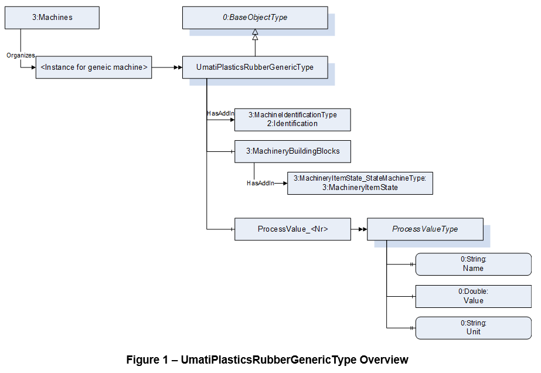

# umati showcase information model for Plastics and Rubber machines Generic Model

## 1. General
The namespace for the instances is manufacturer specific, e.g. http://samplemanufacturer.com/umati_plasticsrubber_generic_sample_instance/

Table 1 shows the complete structure of the instance needed for the umati demonstrator when two process values are used. The demonstrator requires, that all mandatory elements of used MachineIdentificationType are existent, even if there are not displayed in the dashboard. If the value of a variable a not displayed, is can be filled with a static dummy value (e.g. empty string). All displayed values are highlighted in light-blue.

Download: [Compleate documentation umati showcase information model Plastics and Rubber](https://github.com/umati/Showcase/tree/main/img/PlasticsRubber/PR_Generic_PDF.pdf)

**Table 1 – Sample instance of UmatiPlasticsRubberGenericType**

|**BrowseName**|**Type**|**Example Value**|**Remarks**|
| :- | :- | :- | :- |
|Objects||||
|&ensp; Machines||||
|&ensp;&ensp; &lt;EntryNodeforMachine>|UmatiPlasticsRubberGenericType|||
|&ensp;&ensp;&ensp; 2:Identification|3:MachineIdentificationType|||
|&ensp;&ensp;&ensp;&ensp; 2:ProductInstanceUri||“http://samplemanufacturer.com/BM123”|1)|
|&ensp;&ensp;&ensp;&ensp; 2:Manufacturer|0:LocalizedText|“Sample Manufacturer”||
|&ensp;&ensp;&ensp;&ensp; 2:Model|0:LocalizedText|“Machine Model 3000”|2)|
|&ensp;&ensp;&ensp;&ensp; 2:SerialNumber|0:String|“BM123”||
|&ensp;&ensp;&ensp;&ensp; 2:DeviceClass|0:String|“Blow moulding machine”||
|&ensp;&ensp;&ensp;&ensp; 3:Location|0:String|“K 14 F42/N 51.260407 E 6.744588”|2), 3)|
|||||
|&ensp;&ensp;&ensp; 3:MachineryBulidingBlocks|0:FolderType|||
|&ensp;&ensp;&ensp;&ensp; MachineryItemState|3:MachineryItemState\_ StateMachineType|||
|&ensp;&ensp;&ensp;&ensp;&ensp; 0:CurrentState|0:LocalizedText|“Executing”||
|&ensp;&ensp;&ensp;&ensp;&ensp;&ensp; 0:Id|0:NodeId|ns=3,i=5006|1)|
|||||
|&ensp;&ensp;&ensp; ProcessValue\_1|ProcessValueType|||
|&ensp;&ensp;&ensp;&ensp; Name|0:String|“Temperature”||
|&ensp;&ensp;&ensp;&ensp; Value|0:Double|120.5||
|&ensp;&ensp;&ensp;&ensp; Unit|0:String|“°C”||
|||||
|&ensp;&ensp;&ensp; ProcessValue\_2|ProcessValueType|||
|&ensp;&ensp;&ensp;&ensp; Name|0:String|“Pressure”||
|&ensp;&ensp;&ensp;&ensp; Value|0:Double|5.2||
|&ensp;&ensp;&ensp;&ensp; Unit|0:String|“bar”||

1)	This variable is mandatory in the model but will not be displayed in the demonstrator
2)	Not mandatory in OPC UA for Machinery but for this model and will be displayed in the demonstrator
3)	See https://showcase.umati.org/Dashboard.html#location-of-fair-machine-and-software-icons-on-the-dashboard for rules for filling the location.

## 2. Process values for different machine types

The process values are modelled as optional placeholder in the generic model. This allows the model to be used for different machine types with reasonable effort. However, the contents should be the same for all machines of the same type.

### 2.1 Blow Moulding

DeviceClass: “Blow moulding machine”

||**Description**|**Name**|**Unit**|
| :- | :- | :- | :- |
|**ProcessValue\_1**|Temperature of …|“Temperature”|“°C” or “°F”|
|**ProcessValue\_2**|Pressure of …|“Pressure”|“bar” or “psi”|

### 2.2	Particle Foam Machines

DeviceClass: “Particle foam machine”

||**Description**|**Name**|**Unit**|
| :- | :- | :- | :- |
|**ProcessValue\_1**|Temperature of …|“Temperature”|“°C” or “°F”|
|**ProcessValue\_2**|Pressure of …|“Pressure”|“bar” or “psi”|
